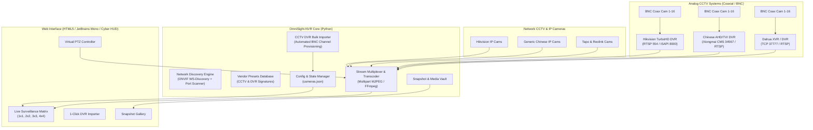

# ✦ OmniSight-NVR

> **The Universal Multi-Vendor CCTV & IP Camera Surveillance Hub**  
> *Crafted with an Apple-grade Cupertino frosted-glass aesthetic. Unifying Hikvision DVRs, Dahua XVRs, Xiongmai Chinese CCTV boxes, analog BNC cameras, and ONVIF streams under one web dashboard.*

🌐 **Live GitHub Pages Web App:** [https://mikoyae-ai.github.io/OmniSight-NVR/](https://mikoyae-ai.github.io/OmniSight-NVR/)

---

## 👁️ The Problem OmniSight Solves

Whether you are running **analog CCTV cameras** wired via coaxial BNC cables into a DVR box or older **IP surveillance cameras**:
- **Hikvision CCTV DVRs / TurboHD** demand *iVMS-4200* or *Hik-Connect*.
- **Dahua XVR / DVRs** demand *SmartPSS* or *DMSS*.
- **Generic Chinese CCTV DVRs & Cameras** (Xiongmai / HiSilicon / Sofia chipsets) force you to use outdated Windows *CMS* software, sketchy cloud apps (*XMeye*, *V380*, *Yoosee*), or broken Internet Explorer ActiveX plugins.
- **Abandoned Camera Firmware**: Millions of older cameras refuse to load in Chrome or Firefox, demanding 32-bit Internet Explorer.

**OmniSight-NVR** completely eliminates Internet Explorer, Microsoft Edge, and vendor bloatware. It features an Apple-inspired frosted glass interface, community-driven **OpenIPC** firmware integration, and direct hardware control without plugins.

---

## ⚡ Key Highlights

- ** Apple Cupertino Aesthetic**: Designed with San Francisco typography, frosted glassmorphism (`backdrop-filter: blur(28px)`), refined segmented matrix controls, and Apple Home-inspired camera cards.
- ** OpenIPC Community Firmware Directory**: Direct firmware discovery and guides for **OpenIPC** (openipc.org) and **Thingino**. Replace closed-source Chinese camera firmware on HiSilicon, Xiongmai XM530, Ingenic T31, and SigmaStar chips with 100% open-source Linux, WebRTC video, and root SSH.
- **⚙️ Zero-IE / Zero-Edge Direct Camera Control**: Change hardware parameters (reboot, day/night IR-cut filter, time sync, OSD rename) directly via native HTTP ISAPI & CGI commands without ever launching Microsoft Edge or Internet Explorer.
- **CCTV DVR Multi-Channel Bulk Importer**: Have an 8-channel or 16-channel Hikvision or Chinese CCTV DVR box? Enter the DVR IP and provision all BNC coaxial camera channels into your web matrix simultaneously in seconds!
- **In-Browser LAN Subnet Scanner**: Runs directly on GitHub Pages using browser-native probes to discover active cameras on your home network without any backend!
- **Universal Protocol Ingestion**: RTSP streams, ONVIF Profile S, direct HTML5 snapshot polling, HTTP/MJPEG, and procedural CCTV test streams.
- **Ultra-Lean Zero-Dependency Core**: The backend runs purely on vanilla Python 3 standard library and Pillow.
- **Responsive Surveillance Matrix**: Dynamic grid layouts (1×1 focus, 2×2 quad, 3×3, 4×4).
- **Virtual PTZ Joypad**: Tactile pan, tilt, and zoom controls.
- **Instant Snapshot Capture**: High-speed still capture with built-in gallery and timestamped archive.

---

## 🏛️ System Architecture



---

## 🚀 Quickstart

### Option 1: Direct Run (Zero Installation)

Requirements: Python 3.8+ with `Pillow` (already installed on most Linux distros).

```bash
# Clone the repository
git clone https://github.com/MikoYae-AI/OmniSight-NVR.git
cd OmniSight-NVR

# Launch the surveillance hub
./start.sh 8080
```

Open your browser at **`http://localhost:8080`**.

### Option 2: Docker / Docker Compose

```bash
cd docker
docker compose up -d
```

*(Note: Docker uses `network_mode: host` to enable local ONVIF UDP multicast discovery and low-latency RTSP streaming).*

---

## 📋 Camera Compatibility & RTSP Cheat Sheet

| Brand / Chipset | Signature Ports | Default RTSP URL Format | Default User / Pass |
|---|---|---|---|
| **Hikvision** (DS-2CD, ColorVu) | 554, 8000, 80 | `rtsp://admin:pass@ip:554/Streaming/Channels/101` | `admin` / set on setup |
| **Dahua & Imou** (IPC, WizSense) | 554, 37777, 80 | `rtsp://admin:pass@ip:554/cam/realmonitor?channel=1&subtype=0` | `admin` / `admin` |
| **Xiongmai (XM)** (Generic Chinese) | 554, 34567, 8899 | `rtsp://admin:pass@ip:554/live/ch0` | `admin` / (blank) |
| **TP-Link Tapo** (C200, C310) | 554, 2020 | `rtsp://user:pass@ip:554/stream1` | Configured in App |
| **Reolink** (RLC, Duo, TrackMix) | 554, 8000 | `rtsp://admin:pass@ip:554/h264Preview_01_main` | `admin` / (blank) |
| **Yoosee / Cooau** | 554, 5000 | `rtsp://admin:pass@ip:554/onvif1` | `admin` / `123456` |
| **V380 / V380 Pro** | 554, 8899 | `rtsp://admin:pass@ip:554/live/ch0` | `admin` / (blank) |
| **ESP32-CAM / IP Webcam** | 80, 8080 | `http://ip:port/stream` or `/mjpeg` | None |

### Critical Brand Quirks:
- **Hikvision**: ONVIF is often disabled out-of-the-box. Go to *Configuration → Network → Advanced Settings → Integration Protocol*, enable ONVIF, and add an ONVIF user with **Digest/Basic** authentication.
- **Xiongmai / Chinese Cameras**: These chipsets communicate on TCP port **34567** (NetSurveillance CMS port). If the RTSP stream URL fails, the camera's media port is usually open on 34567.
- **Tapo**: Do not use your TP-Link cloud account password! Create a dedicated local camera account inside the Tapo mobile app under *Device Settings → Advanced Settings → Camera Account*.

---

## 📡 REST API Reference

| Method | Endpoint | Description |
|---|---|---|
| `GET` | `/api/status` | System health, uptime, and ffmpeg status |
| `GET` | `/api/cameras` | List configured cameras, active layout, and groups |
| `POST` | `/api/cameras` | Register a new camera |
| `PUT` | `/api/cameras/{id}` | Update existing camera configuration |
| `DELETE` | `/api/cameras/{id}` | Delete a camera |
| `GET` | `/api/cameras/{id}/stream` | Live multipart/x-mixed-replace MJPEG video feed |
| `GET` | `/api/cameras/{id}/snapshot` | Fetch single frame JPEG still |
| `POST` | `/api/cameras/{id}/ptz` | Send PTZ action (`up`, `down`, `left`, `right`, `zoom_in`, `zoom_out`, `home`) |
| `GET` | `/api/presets` | Get full database of camera brand presets & quirks |
| `POST` | `/api/presets/generate` | Calculate RTSP stream URL based on vendor syntax |
| `GET` | `/api/discovery/scan` | Broadcast ONVIF WS-Discovery probe & scan LAN subnet |
| `GET` | `/api/snapshots` | List captured snapshot images |
| `POST` | `/api/snapshots/capture` | Capture and save a snapshot to storage vault |
| `DELETE` | `/api/snapshots/{filename}` | Delete a snapshot file |
| `POST` | `/api/layout` | Persist grid layout (`1x1`, `2x2`, `3x3`, `4x4`) |

---

## 🌐 Remote Access & Multi-Network Setup (Connecting From Outside Home)

When you are away from home or connected to a different Wi-Fi network (cellular, work Wi-Fi, etc.), direct local IP addresses (like `192.168.1.x`) are unreachable. Here are the **3 best ways** to access your home OmniSight-NVR hub and cameras remotely:

---

### Option 1: Mesh VPN with Tailscale or WireGuard (⭐ Recommended)

A mesh VPN creates a secure, encrypted peer-to-peer virtual private network between your devices without opening ports on your home router.

1. **Install Tailscale** on the computer/Raspberry Pi running OmniSight-NVR at home, and on your remote phone/laptop.
2. **Enable Tailscale Subnet Router** (optional) on your home server so you can access your home IP camera subnets directly:
   ```bash
   sudo tailscale up --advertise-routes=192.168.1.0/24
   ```
3. Connect your remote device to Tailscale. You can now access your OmniSight dashboard using its Tailscale IP (e.g., `http://100.x.y.z:8080`) or local home IP (`192.168.1.x:8080`) as if you were connected to your home Wi-Fi!

---

### Option 2: Cloudflare Tunnel (Zero Trust)

Expose your local OmniSight-NVR dashboard securely to a custom web domain (e.g., `nvr.yourdomain.com`) over HTTPS with SSL and authentication:

1. Install `cloudflared` on your home server running OmniSight-NVR.
2. Authenticate and create a tunnel pointing to your local OmniSight server (`http://localhost:8080`):
   ```bash
   cloudflared tunnel create omnisight
   cloudflared tunnel run --url http://localhost:8080 omnisight
   ```
3. Add Cloudflare Access policies to restrict access to authorized email logins or 2FA.

---

### Option 3: Port Forwarding + Dynamic DNS (DDNS)

Direct router port forwarding allows direct connection to your home public IP:

1. **Configure DDNS**: Use a provider like No-IP or DuckDNS to map your home WAN IP to a hostname (e.g., `myhome.duckdns.org`).
2. **Port Forwarding**: In your home router settings, forward WAN port `8080` (or a custom high port like `8443`) to your local NVR server IP (`192.168.1.x:8080`).
3. **Security Precaution**: Ensure OmniSight-NVR session authentication is enabled and use strong passwords when exposing ports directly to the public internet.

---

## 🛠️ Hardware Transcoding (Optional)

OmniSight includes a built-in simulation and HTTP MJPEG parser that runs with **zero dependencies**.

For ingesting raw RTSP H.264/H.265 feeds from physical hardware, install `ffmpeg`:
```bash
# Debian / Ubuntu / Mint
sudo apt install -y ffmpeg

# Arch Linux
sudo pacman -S ffmpeg
```
When `ffmpeg` is detected, OmniSight automatically taps into hardware-accelerated demuxing.

---

## 📜 License

MIT License © 2026 [MikoYae-AI](https://github.com/MikoYae-AI)
