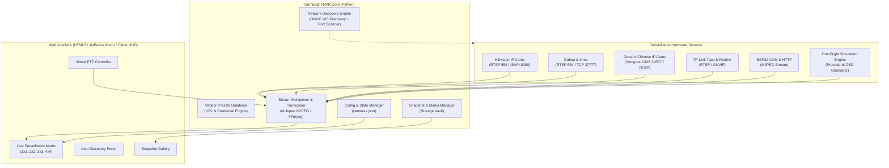

# ✦ OmniSight-NVR

> **The Universal Multi-Vendor Camera & NVR Surveillance Hub**  
> *Unifying Hikvision, Dahua, Xiongmai, generic Chinese IP cams, and ONVIF devices under one high-performance, dark-aesthetic web dashboard.*

---

## 👁️ The Problem OmniSight Solves

In the real world, IP surveillance is a fragmented nightmare:
- **Hikvision** locks you into *iVMS-4200* or *Hik-Connect*.
- **Dahua** demands *SmartPSS* or *DMSS*.
- **Generic Chinese cameras** (Xiongmai / HiSilicon / Sofia chipsets) rely on clunky ActiveX plugins, *CMS*, or shady cloud apps like *XMeye*, *V380*, or *Yoosee*.
- **Consumer cams** (TP-Link Tapo, Reolink) trap you inside mobile apps.

Running 4 different vendor programs just to see your cameras is bloated, inefficient, and insecure.

**OmniSight-NVR** destroys vendor lock-in. It bridges every camera brand into a single, sleek, low-latency web matrix accessible from any browser on your desktop, laptop, tablet, or phone.

---

## ⚡ Key Highlights

- **Universal Protocol Ingestion**: RTSP streams, ONVIF Profile S, HTTP/MJPEG (ESP32-CAM, IP Webcam), and virtual test streams.
- **Built-in ONVIF & LAN Scanner**: One-click network scanner using WS-Discovery (UDP 3702) and signature port probing (554, 34567, 37777, 8000, 8899) to detect and identify camera chipsets automatically.
- **Vendor Presets Database**: Automated connection string generation for Hikvision, Dahua, Xiongmai, Tapo, Reolink, V380, Yoosee, Uniview, and Axis.
- **Ultra-Lean Zero-Dependency Core**: The backend runs purely on vanilla Python 3 standard library and Pillow. No heavyweight database or complex microservices required.
- **Responsive Surveillance Matrix**: Dynamic grid layouts (1×1 focus, 2×2 quad, 3×3, 4×4) with dark gothic cybersecurity aesthetics.
- **Virtual PTZ Joypad**: On-screen pan, tilt, and zoom controls.
- **Instant Snapshot Capture**: High-speed still capture with built-in gallery and timestamped archive.
- **Out-of-the-Box Simulation**: Ships with realistic procedural surveillance streams so you can explore the full UI immediately without needing physical cameras plugged in.

---

## 🏛️ System Architecture



---

## 🚀 Quickstart

### Option 1: Direct Run (Zero Installation)

Requirements: Python 3.8+ with `Pillow` (already installed on most Linux distros).

```bash
# Clone the repository
git clone https://github.com/MikoYae-AI/OmniSight-NVR.git
cd OmniSight-NVR

# Launch the surveillance hub
./start.sh 8080
```

Open your browser at **`http://localhost:8080`**.

### Option 2: Docker / Docker Compose

```bash
cd docker
docker compose up -d
```

*(Note: Docker uses `network_mode: host` to enable local ONVIF UDP multicast discovery and low-latency RTSP streaming).*

---

## 📋 Camera Compatibility & RTSP Cheat Sheet

| Brand / Chipset | Signature Ports | Default RTSP URL Format | Default User / Pass |
|---|---|---|---|
| **Hikvision** (DS-2CD, ColorVu) | 554, 8000, 80 | `rtsp://admin:pass@ip:554/Streaming/Channels/101` | `admin` / set on setup |
| **Dahua & Imou** (IPC, WizSense) | 554, 37777, 80 | `rtsp://admin:pass@ip:554/cam/realmonitor?channel=1&subtype=0` | `admin` / `admin` |
| **Xiongmai (XM)** (Generic Chinese) | 554, 34567, 8899 | `rtsp://admin:pass@ip:554/live/ch0` | `admin` / (blank) |
| **TP-Link Tapo** (C200, C310) | 554, 2020 | `rtsp://user:pass@ip:554/stream1` | Configured in App |
| **Reolink** (RLC, Duo, TrackMix) | 554, 8000 | `rtsp://admin:pass@ip:554/h264Preview_01_main` | `admin` / (blank) |
| **Yoosee / Cooau** | 554, 5000 | `rtsp://admin:pass@ip:554/onvif1` | `admin` / `123456` |
| **V380 / V380 Pro** | 554, 8899 | `rtsp://admin:pass@ip:554/live/ch0` | `admin` / (blank) |
| **ESP32-CAM / IP Webcam** | 80, 8080 | `http://ip:port/stream` or `/mjpeg` | None |

### Critical Brand Quirks:
- **Hikvision**: ONVIF is often disabled out-of-the-box. Go to *Configuration → Network → Advanced Settings → Integration Protocol*, enable ONVIF, and add an ONVIF user with **Digest/Basic** authentication.
- **Xiongmai / Chinese Cameras**: These chipsets communicate on TCP port **34567** (NetSurveillance CMS port). If the RTSP stream URL fails, the camera's media port is usually open on 34567.
- **Tapo**: Do not use your TP-Link cloud account password! Create a dedicated local camera account inside the Tapo mobile app under *Device Settings → Advanced Settings → Camera Account*.

---

## 📡 REST API Reference

| Method | Endpoint | Description |
|---|---|---|
| `GET` | `/api/status` | System health, uptime, and ffmpeg status |
| `GET` | `/api/cameras` | List configured cameras, active layout, and groups |
| `POST` | `/api/cameras` | Register a new camera |
| `PUT` | `/api/cameras/{id}` | Update existing camera configuration |
| `DELETE` | `/api/cameras/{id}` | Delete a camera |
| `GET` | `/api/cameras/{id}/stream` | Live multipart/x-mixed-replace MJPEG video feed |
| `GET` | `/api/cameras/{id}/snapshot` | Fetch single frame JPEG still |
| `POST` | `/api/cameras/{id}/ptz` | Send PTZ action (`up`, `down`, `left`, `right`, `zoom_in`, `zoom_out`, `home`) |
| `GET` | `/api/presets` | Get full database of camera brand presets & quirks |
| `POST` | `/api/presets/generate` | Calculate RTSP stream URL based on vendor syntax |
| `GET` | `/api/discovery/scan` | Broadcast ONVIF WS-Discovery probe & scan LAN subnet |
| `GET` | `/api/snapshots` | List captured snapshot images |
| `POST` | `/api/snapshots/capture` | Capture and save a snapshot to storage vault |
| `DELETE` | `/api/snapshots/{filename}` | Delete a snapshot file |
| `POST` | `/api/layout` | Persist grid layout (`1x1`, `2x2`, `3x3`, `4x4`) |

---

## 🛠️ Hardware Transcoding (Optional)

OmniSight includes a built-in simulation and HTTP MJPEG parser that runs with **zero dependencies**.

For ingesting raw RTSP H.264/H.265 feeds from physical hardware, install `ffmpeg`:
```bash
# Debian / Ubuntu / Mint
sudo apt install -y ffmpeg

# Arch Linux
sudo pacman -S ffmpeg
```
When `ffmpeg` is detected, OmniSight automatically taps into hardware-accelerated demuxing.

---

## 📜 License

MIT License © 2026 [MikoYae-AI](https://github.com/MikoYae-AI)
