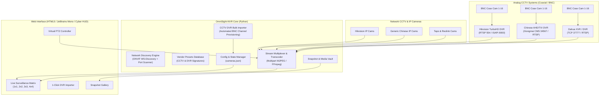

# ✦ OmniSight-NVR

> **The Universal Multi-Vendor CCTV & IP Camera Surveillance Hub**  
> *Crafted with an Apple-grade Cupertino frosted-glass aesthetic. Unifying Hikvision DVRs, Dahua XVRs, Xiongmai Chinese CCTV boxes, analog BNC cameras, and ONVIF streams under one web dashboard.*

🌐 **Live GitHub Pages Web App:** [https://mikoyae-ai.github.io/OmniSight-NVR/](https://mikoyae-ai.github.io/OmniSight-NVR/)

---

## 👁️ The Problem OmniSight Solves

Whether you are running **analog CCTV cameras** wired via coaxial BNC cables into a DVR box or older **IP surveillance cameras**:
- **Hikvision CCTV DVRs / TurboHD** demand *iVMS-4200* or *Hik-Connect*.
- **Dahua XVR / DVRs** demand *SmartPSS* or *DMSS*.
- **Generic Chinese CCTV DVRs & Cameras** (Xiongmai / HiSilicon / Sofia chipsets) force you to use outdated Windows *CMS* software, sketchy cloud apps (*XMeye*, *V380*, *Yoosee*), or broken Internet Explorer ActiveX plugins.
- **Abandoned Camera Firmware**: Millions of older cameras refuse to load in Chrome or Firefox, demanding 32-bit Internet Explorer.

**OmniSight-NVR** completely eliminates Internet Explorer, Microsoft Edge, and vendor bloatware. It features an Apple-inspired frosted glass interface, community-driven **OpenIPC** firmware integration, and direct hardware control without plugins.

---

## ⚡ Key Highlights

- ** Apple Cupertino Aesthetic**: Designed with San Francisco typography, frosted glassmorphism (`backdrop-filter: blur(28px)`), refined segmented matrix controls, and Apple Home-inspired camera cards.
- ** OpenIPC Community Firmware Directory**: Direct firmware discovery and guides for **OpenIPC** (openipc.org) and **Thingino**. Replace closed-source Chinese camera firmware on HiSilicon, Xiongmai XM530, Ingenic T31, and SigmaStar chips with 100% open-source Linux, WebRTC video, and root SSH.
- **⚙️ Zero-IE / Zero-Edge Direct Camera Control**: Change hardware parameters (reboot, day/night IR-cut filter, time sync, OSD rename) directly via native HTTP ISAPI & CGI commands without ever launching Microsoft Edge or Internet Explorer.
- **CCTV DVR Multi-Channel Bulk Importer**: Have an 8-channel or 16-channel Hikvision or Chinese CCTV DVR box? Enter the DVR IP and provision all BNC coaxial camera channels into your web matrix simultaneously in seconds!
- **In-Browser LAN Subnet Scanner**: Runs directly on GitHub Pages using browser-native probes to discover active cameras on your home network without any backend!
- **Universal Protocol Ingestion**: RTSP streams, ONVIF Profile S, direct HTML5 snapshot polling, HTTP/MJPEG, and procedural CCTV test streams.
- **Ultra-Lean Zero-Dependency Core**: The backend runs purely on vanilla Python 3 standard library and Pillow.
- **Responsive Surveillance Matrix**: Dynamic grid layouts (1×1 focus, 2×2 quad, 3×3, 4×4).
- **Virtual PTZ Joypad**: Tactile pan, tilt, and zoom controls.
- **Instant Snapshot Capture**: High-speed still capture with built-in gallery and timestamped archive.

---

## 🏛️ System Architecture


```mermaid
flowchart TD
    subgraph AnalogCCTV["Analog CCTV Systems (Coaxial / BNC)"]
        BNC1["BNC Coax Cam 1-16"] --> HIK_DVR["Hikvision TurboHD DVR\n(RTSP 554 / ISAPI 8000)"]
        BNC2["BNC Coax Cam 1-16"] --> XM_DVR["Chinese AHD/TVI DVR\n(Xiongmai CMS 34567 / RTSP)"]
        BNC3["BNC Coax Cam 1-16"] --> DAH_DVR["Dahua XVR / DVR\n(TCP 37777 / RTSP)"]
    end

    subgraph IPCCTV["Network CCTV & IP Cameras"]
        IPC_HIK["Hikvision IP Cams"]
        IPC_XM["Generic Chinese IP Cams"]
        IPC_TAPO["Tapo & Reolink Cams"]
    end

    subgraph Backend["OmniSight-NVR Core (Python)"]
        DVR_IMP["CCTV DVR Bulk Importer\n(Automated BNC Channel Provisioning)"]
        DISC["Network Discovery Engine\n(ONVIF WS-Discovery + Port Scanner)"]
        PRESETS["Vendor Presets Database\n(CCTV & DVR Signatures)"]
        STREAM["Stream Multiplexer & Transcoder\n(Multipart MJPEG / FFmpeg)"]
        CONFIG["Config & State Manager\n(cameras.json)"]
        REC["Snapshot & Media Vault"]
    end

    subgraph Frontend["Web Interface (HTML5 / JetBrains Mono / Cyber HUD)"]
        DASH["Live Surveillance Matrix\n(1x1, 2x2, 3x3, 4x4)"]
        PTZ["Virtual PTZ Controller"]
        DVR_MODAL["1-Click DVR Importer"]
        GALLERY["Snapshot Gallery"]
    end

    HIK_DVR --> STREAM
    XM_DVR --> STREAM
    DAH_DVR --> STREAM
    IPC_HIK --> STREAM
    IPC_XM --> STREAM
    IPC_TAPO --> STREAM

    DVR_IMP --> CONFIG
    STREAM --> DASH
    PTZ --> STREAM
    CONFIG --> DASH
    REC --> GALLERY
```

---

## 🚀 Quickstart

### Option 1: Direct Run (Zero Installation)

Requirements: Python 3.8+ with `Pillow` (already installed on most Linux distros).

```bash
# Clone the repository
git clone https://github.com/MikoYae-AI/OmniSight-NVR.git
cd OmniSight-NVR

# Launch the surveillance hub
./start.sh 8080
```

Open your browser at **`http://localhost:8080`**.

### Option 2: Docker / Docker Compose

```bash
cd docker
docker compose up -d
```

*(Note: Docker uses `network_mode: host` to enable local ONVIF UDP multicast discovery and low-latency RTSP streaming).*

---

## 📋 Universal Camera Compatibility Matrix (40+ Brands & Standards)

OmniSight-NVR supports virtually every surveillance camera and video source on the market:

| Category | Brands / Standards Supported | Protocols & Detection | Signature Ports |
|---|---|---|---|
| **Mainstream Commercial** | **Hikvision**, **Dahua**, **Amcrest**, **Uniview (UNV)**, **Axis (VAPIX)**, **Hanwha (Wisenet)**, **Bosch**, **Sony (IPELA)**, **Panasonic**, **Vivotek** | RTSP TCP/UDP, ISAPI, CGI, ONVIF Profile S/G/T | 554, 80, 8000, 37777 |
| **Consumer Smart Security** | **TP-Link Tapo & Kasa**, **Reolink**, **Wyze**, **Eufy**, **Foscam**, **Tuya / Smart Life**, **Yoosee**, **V380 Pro**, **V360 Pro**, **SriHome**, **UniFi Protect**, **D-Link**, **Milesight**, **Mobotix** | RTSP, ONVIF, Two-Way Talkback, P2P/NAS LAN RTSP | 554, 2020, 8000, 8899, 7447 |
| **CCTV DVR / XVR / NVR** | **Hikvision TurboHD**, **Dahua XVR**, **Amcrest DVR**, **Uniview NVR**, **Xiongmai CMS DVR**, **ZOSI / Lorex** | Multi-channel BNC Coaxial Bulk Ingestion | 554, 34567, 37777 |
| **Chinese White-Label OEM** | **Xiongmai (XM / Sofia)**, **GatoCam**, **Anran**, **Jovision**, **TVT**, **Tiandy**, **Sunell**, **Longse**, **Cantonk**, **Wansview**, **SV3C**, **Dericam**, **Ctronics** | HiSilicon/Goke/XM530, Zero-IE Snapshot Polling, OpenIPC | 554, 34567, 8899 |
| **DIY & Embedded** | **ESP32-CAM**, **Raspberry Pi (libcamera / mjpg-streamer)**, **IP Webcam (Android)** | HTTP Multipart MJPEG, HLS, WebRTC | 80, 81, 8080, 4747 |
| **System Webcams & Nodes** | **Local USB Webcams (DirectShow / V4L2)**, **📱 Browser Camera Nodes** | USB UVC, Browser `getUserMedia` HTML5 Ingestion | `webcam://0`, `node://id` |
| **Generic Protocols** | **ONVIF Profile S**, **Custom RTSP (TCP & UDP)**, **RTMP Live Streams**, **HTTP HLS (.m3u8)** | FFmpeg Multiplexer with Auto-Transport Fallback | Custom |

### ⚡ Universal Connection Prober & Diagnostic
OmniSight includes an intelligent low-latency connection prober (`POST /api/cameras/probe`). It issues raw TCP RTSP `DESCRIBE` handshakes, tests snapshot URIs, extracts SDP video/audio codecs (H.264, H.265/HEVC, AAC), determines network latency, and automatically recommends the optimal connection mode for your camera.

### 📱 Browser Camera Node (Stream Phone or Laptop into Matrix)
Transform any smartphone, iPad, tablet, or laptop into a live wireless CCTV camera node. With one click on **"📱 Camera Node"**, your device captures video via HTML5 `getUserMedia` and streams it directly into the OmniSight surveillance matrix at 1080p/720p.

---

## 🧩 Hikvision: "Please install WebComponents.exe" (and similar IE plugins)

Hikvision's own web UI asks for **WebComponents.exe** — an Internet Explorer ActiveX
control — on the DS-2CD, ColorVu, AcuSense, TurboHD and most other Hikvision families.
You do **not** need it, and you do not need Internet Explorer. That plugin talks to the
camera over plain HTTP (ISAPI with Digest auth); OmniSight talks to the same interface.

Plugin-free Hikvision sources, all used automatically:

| Source | URL | Notes |
|---|---|---|
| **Live MJPEG** | `http://<ip>/ISAPI/Streaming/channels/101/httpPreview` | Continuous multipart video at full framerate — exactly what WebComponents.exe consumed |
| Still image | `http://<ip>/ISAPI/Streaming/channels/101/picture` | Used when MJPEG is unavailable |
| Older firmware | `http://<ip>/PSIA/Streaming/channels/101/picture` | PSIA API, pre-ISAPI models |
| Legacy path | `http://<ip>/Streaming/Channels/101/picture` | Early firmware before `/ISAPI` |
| RTSP | `rtsp://<ip>:554/Streaming/Channels/101` | Native stream, with `102` for sub-stream |

`101` = channel 1 main stream (`102` = sub-stream; channel 2 = `201`, and so on).

**If you want to check this yourself:** open `http://<camera-ip>/ISAPI/Streaming/channels/101/picture`
in Chrome, Firefox or Safari and sign in with the camera username/password. You get a
still image — no plugin prompt, no ActiveX, no IE. That same URL is what OmniSight polls.

Order of preference in OmniSight: RTSP via FFmpeg when available → ISAPI/PSIA MJPEG
(plugin-free, no FFmpeg needed) → ISAPI/PSIA snapshots → clear HUD message if the
credentials or network are wrong. Digest authentication is fully supported, which is
mandatory on Hikvision firmware.

The same applies to Dahua/Amcrest (**webplugin.exe**, replaced by `/cgi-bin/mjpg/video.cgi`
and `/cgi-bin/snapshot.cgi`) and other ActiveX-era plugins.

---

## 🧩 Cameras That "Require Internet Explorer" (ActiveX-only CCTV)

Many older DVR boxes and Chinese OEM cameras have no usable video path outside their
ActiveX control: the web UI shows a plugin download, and the RTSP port stays open with
no working stream path. OmniSight drives these cameras through the one interface they
*do* expose — a raw JPEG endpoint — and polls it at framerate in pure HTML5.

How it works (no Internet Explorer, no plugin, no ActiveX):

1. Pick the vendor **"Legacy Camera (Requires Internet Explorer / ActiveX)"** when adding
   the camera. Snapshot polling is enabled automatically and RTSP is not assumed.
2. OmniSight probes the camera's known still-image endpoints
   (`/webcapture.jpg?command=snap&channel=N`, `/snapshot.jpg`, `/cgi-bin/snapshot.cgi`,
   `/ISAPI/Streaming/channels/101/picture`, `/onvif-http/snapshot?Profile_1`, and more),
   including the ActiveX-style query strings that bare paths fail to answer.
3. The first endpoint that returns a real JPEG becomes the camera's source and is stored
   on the camera config (`snapshot_url`), so it survives restarts.
4. Basic **and** Digest authentication are supported, so password-protected cameras work.

Frames are fetched **by the NVR server**, not by your browser. That matters because a
browser on an HTTPS page (e.g. GitHub Pages) is blocked from calling `http://192.168.x.x`
by mixed-content and CORS rules — routing through the server sidesteps both.

If a legacy camera still shows an amber "auto-detecting snapshot endpoint" HUD, the endpoints
it tried did not return a JPEG. Check the camera's web UI in a browser, then paste the
working image path into **Edit Camera → Stream URL** (or set `snapshot_url`) and it will be
used verbatim.

---

## 🩺 Camera Troubleshooting (Why is a camera not working?)

Every camera card shows a real status dot driven by live telemetry, not by the static
config value:

| Dot | Status | Meaning | Typical cause |
|---|---|---|---|
| 🟢 | `streaming` | Frames are arriving from the camera | — |
| 🟡 | `connecting` / `reconnecting` | Ingest worker is retrying | Wrong IP/port/password, camera offline, network blocked, or no FFmpeg for RTSP |
| 🔴 | `error` | Ingestion cannot run at all | FFmpeg missing and the camera exposes no snapshot CGI |

How a camera is ingested (in priority order):

1. `webcam://` / USB → DirectShow / V4L2 capture.
2. `node://` → Browser Camera Node ingestion.
3. **ActiveX / "requires IE" cameras** → HTTP ingestion with automatic endpoint discovery
   (see the sections above). These are never assumed to have a usable RTSP path.
4. **Real network URL** (`rtsp://`, `rtsps://`, `rtmp://`, `*.m3u8`) → FFmpeg ingest with
   automatic TCP → UDP → HTTP transport fallback. This now applies even if the camera still
   has an old `is_simulated` flag set — a real source URL always wins.
5. If FFmpeg is missing, or RTSP keeps failing, and the vendor exposes a plugin-free HTTP
   source (Hikvision ISAPI `httpPreview`, Dahua `/cgi-bin/mjpg/video.cgi`, XM/ISAPI
   snapshots, …) → **continuous MJPEG first, then snapshot polling** takes over.
6. `sim://` (or no source URL at all) → procedural simulator.

Checks worth running when a camera misbehaves:

```bash
# Is FFmpeg available? RTSP/RTMP/HLS ingestion needs it.
curl -s http://localhost:8080/api/status | grep ffmpeg

# What is this camera actually doing right now?
curl -s -H "Authorization: Bearer <token>" http://localhost:8080/api/cameras/<id>/status
```

- **The host running OmniSight must be able to reach the camera.** Cameras on `192.168.x.x`
  are only reachable from the machine on that LAN — a hosted/cloud instance cannot see them.
- Run the built-in prober (`POST /api/cameras/probe`) to check ports, RTSP `DESCRIBE`,
  codecs, and whether the credentials actually authenticate.
- Credentials are trimmed automatically on save, so a stray space in a username
  (`"admin "`) can no longer break every authentication attempt.
- Editing a camera restarts its ingest worker immediately — no server restart required.

---

## 📡 REST API Reference

| Method | Endpoint | Description |
|---|---|---|
| `GET` | `/api/status` | System health, uptime, and ffmpeg status |
| `GET` | `/api/cameras` | List configured cameras with live status telemetry, active layout, and groups |
| `POST` | `/api/cameras` | Register a new camera (auto-constructs URLs from vendor presets) |
| `PUT` | `/api/cameras/{id}` | Update existing camera configuration |
| `DELETE` | `/api/cameras/{id}` | Delete a camera |
| `GET` | `/api/cameras/{id}/status` | **Real** live camera state (`streaming`, `connecting`, `reconnecting`, `error`) + last frame age |
| `GET` | `/api/cameras/{id}/stream` | Live multipart/x-mixed-replace MJPEG video feed |
| `GET` | `/api/cameras/{id}/snapshot` | Fetch single frame JPEG still |
| `POST` | `/api/cameras/{id}/ptz` | Pan/Tilt/Zoom action + Hardware dispatch (Hikvision ISAPI, Dahua CGI, Axis, Foscam) |
| `POST` | `/api/cameras/{id}/talk` | Live two-way intercom microphone audio chunk ingestion |
| `POST` | `/api/cameras/{id}/control` | Smart camera controls (Night vision, Siren, Intercom toggle, Auto-Tracking) |
| `GET` | `/api/cameras/{id}/timeline` | 24-Hour historical event markers (Motion, Smart AI, Vehicle, Doorbell) |
| `GET` | `/api/cameras/{id}/playback` | Video scrubbing & historical playback frame streaming |
| `POST` | `/api/cameras/probe` | **Universal Camera Prober**: Tests ports, RTSP DESCRIBE, snapshot URI, and codecs |
| `GET` | `/api/system/webcams` | Enumerate local host USB webcams (DirectShow / V4L2) |
| `POST` | `/api/cameras/{id}/ingest` | **Browser Camera Node**: Ingest live base64 JPEG frames from browser devices |
| `POST` | `/api/dvr/import` | CCTV DVR Multi-channel BNC bulk importer |
| `GET` | `/api/presets` | Get full database of 40+ camera brand presets, ports, and quirks |
| `POST` | `/api/presets/generate` | Calculate RTSP stream URL based on vendor syntax |
| `GET` | `/api/discovery/scan` | Broadcast ONVIF WS-Discovery probe & scan LAN subnet |
| `GET` | `/api/snapshots` | List captured snapshot images |
| `POST` | `/api/snapshots/capture` | Capture and save a snapshot to storage vault |
| `DELETE` | `/api/snapshots/{filename}` | Delete a snapshot file |
| `POST` | `/api/layout` | Persist grid layout (`1x1`, `2x2`, `3x3`, `4x4`) |

---

## 🌐 Remote Access & Multi-Network Setup (Connecting From Outside Home)

When you are away from home or connected to a different Wi-Fi network (cellular, work Wi-Fi, etc.), direct local IP addresses (like `192.168.1.x`) are unreachable. Here are the **3 best ways** to access your home OmniSight-NVR hub and cameras remotely:

---

### Option 1: Mesh VPN with Tailscale or WireGuard (⭐ Recommended)

A mesh VPN creates a secure, encrypted peer-to-peer virtual private network between your devices without opening ports on your home router.

1. **Install Tailscale** on the computer/Raspberry Pi running OmniSight-NVR at home, and on your remote phone/laptop.
2. **Enable Tailscale Subnet Router** (optional) on your home server so you can access your home IP camera subnets directly:
   ```bash
   sudo tailscale up --advertise-routes=192.168.1.0/24
   ```
3. Connect your remote device to Tailscale. You can now access your OmniSight dashboard using its Tailscale IP (e.g., `http://100.x.y.z:8080`) or local home IP (`192.168.1.x:8080`) as if you were connected to your home Wi-Fi!

---

### Option 2: Cloudflare Tunnel (Zero Trust)

Expose your local OmniSight-NVR dashboard securely to a custom web domain (e.g., `nvr.yourdomain.com`) over HTTPS with SSL and authentication:

1. Install `cloudflared` on your home server running OmniSight-NVR.
2. Authenticate and create a tunnel pointing to your local OmniSight server (`http://localhost:8080`):
   ```bash
   cloudflared tunnel create omnisight
   cloudflared tunnel run --url http://localhost:8080 omnisight
   ```
3. Add Cloudflare Access policies to restrict access to authorized email logins or 2FA.

---

### Option 3: Port Forwarding + Dynamic DNS (DDNS)

Direct router port forwarding allows direct connection to your home public IP:

1. **Configure DDNS**: Use a provider like No-IP or DuckDNS to map your home WAN IP to a hostname (e.g., `myhome.duckdns.org`).
2. **Port Forwarding**: In your home router settings, forward WAN port `8080` (or a custom high port like `8443`) to your local NVR server IP (`192.168.1.x:8080`).
3. **Security Precaution**: Ensure OmniSight-NVR session authentication is enabled and use strong passwords when exposing ports directly to the public internet.

---

## 🛠️ Hardware Transcoding (Optional)

OmniSight includes a built-in simulation and HTTP MJPEG parser that runs with **zero dependencies**.

For ingesting raw RTSP H.264/H.265 feeds from physical hardware, install `ffmpeg`:
```bash
# Debian / Ubuntu / Mint
sudo apt install -y ffmpeg

# Arch Linux
sudo pacman -S ffmpeg
```
When `ffmpeg` is detected, OmniSight automatically taps into hardware-accelerated demuxing.

---

## 📜 License

MIT License © 2026 [MikoYae-AI](https://github.com/MikoYae-AI)
